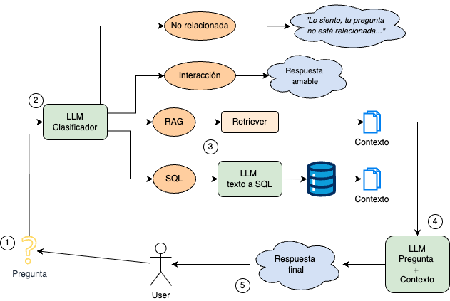

# SoroIA: Un asistente virtual para el Museo Sorolla
Forma parte del Trabajo de Fin de **Máster de Ciencia de Datos** por la Universidad Politécnica de Madrid. Computational Intelligence Group. Julio 2025.
Autor: Federico Castejón Lozano. 
Título completo del TFM: _SoroIA: Diseño e Implementación de un Sistema Conversacional basado en Modelos Grandes de Lenguaje para el Museo Sorolla_


## Descripción del proyecto

**SoroIA** es un chatbot basado en inteligencia artificial diseñado para responder a preguntas de los visitantes del Museo Sorolla. Utiliza técnicas avanzadas de procesamiento del lenguaje natural, como:

- Modelos grandes de lenguaje (**LLMs**)
- Recuperación aumentada con generación (**_Retrieval-Augmented Generation_, RAG**)
- Generación automática de consultas SQL (**_Text-to-SQL_**)
- Visualización contextual de obras e imágenes
- 
A continuación se muestra la arquitectura general del sistema:



## Fuentes de datos
La fuente de datos en la que se basa está disponible en [Colecciones en Red españolas (CER.es)](https://ceres.mcu.es/pages/SimpleSearch?Museo=MSM) y la página web del Ministerio de Cultura sobre el [Museo Sorolla](https://www.cultura.gob.es/msorolla/inicio.html). 

**Nota:** Se han respetado los términos de uso de dichas fuentes, empleando los datos únicamente con fines académicos y sin ánimo comercial. Para cualquier otro uso, es necesaria la autorización de los titulares de los contenidos.

## Contenidos

```bash
├── app.py                   # Aplicación principal en Streamlit
├── utils/                   # Código auxiliar (RAG, Text2SQL, BBDD, imágenes)
├── scraping_ceres/          # Scripts para extraer fichas desde CER.es
├── evaluación/              # Evaluaciones cuantitativas del sistema
├── requirements.txt         # Dependencias del proyecto
└── README.md
```
## Evaluación
En la carpeta ```evaluacion``` se incluyen los experimentos realizados para medir el rendimiento del sistema, con tres enfoques distintos:
* Evaluación de la clasificación de preguntas
* Evaluación de precisión semántica en respuestas con _RAG_
* Evaluación de exactitud en generación de _SQL_
